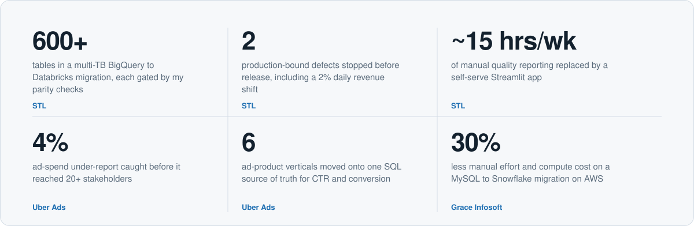
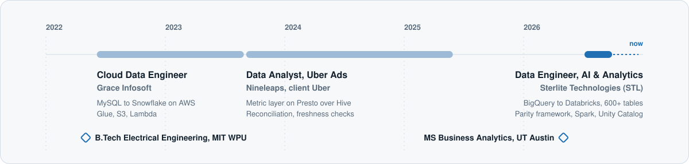
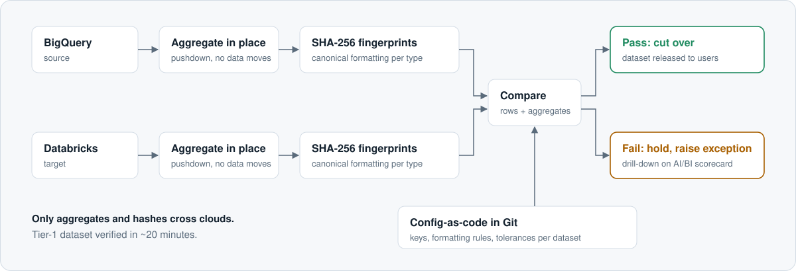

<picture>
  <source media="(prefers-color-scheme: dark)" srcset="assets/hero-dark.svg">
  
</picture>

  <a href="https://www.linkedin.com/in/rohanchimne"><b>LinkedIn</b></a> &nbsp;|&nbsp;
  <a href="mailto:rohan.chimne@utexas.edu"><b>rohan.chimne@utexas.edu</b></a> &nbsp;|&nbsp;
  Open to Data Engineering and Analytics Engineering roles

Two production migrations, three jobs, one through-line: I own whether the data is right. At **STL** I'm moving a multi-TB, 600+ table BigQuery estate onto Databricks and wrote the parity gate every dataset must pass before cutover. At **Uber Ads** I built the SQL metric layer and the reconciliation checks that kept wrong numbers away from 20+ stakeholders.

## Impact

<picture>
  <source media="(prefers-color-scheme: dark)" srcset="assets/impact-dark.svg">
  
</picture>

## Career

<picture>
  <source media="(prefers-color-scheme: dark)" srcset="assets/timeline-dark.svg">
  
</picture>

## How I gate a migration

<picture>
  <source media="(prefers-color-scheme: dark)" srcset="assets/parity-dark.svg">
  
</picture>

The framework I designed at STL. Each engine aggregates and fingerprints its own rows, so multi-TB tables are verified across two clouds without copying data. Migration waves for 23 Tier-1 datasets were sequenced from a dependency graph built on Unity Catalog lineage and BigQuery `INFORMATION_SCHEMA`.

## Selected projects

| Project | What it proves | Stack |
|---|---|---|
| **NYC Airbnb Market Intelligence Platform** | End-to-end warehouse on 102,600 listings: medallion layers, star schema (1 fact, 4 dims), MERGE-based incremental loads, plus a natural-language-to-SQL interface and LLM classification with Snowflake Cortex | Snowflake, SQL, Cortex AI, Streamlit |
| **Airbnb ELT Pipeline** | Bronze, silver and gold layers with SCD Type 2 and incremental models, custom dbt tests and CI on every push | dbt, Databricks, GitHub Actions |
| **Fraud Detection ML Benchmark**  MSBA capstone sponsored by TransUnion | Random Forest, SVM and quantum SVM on identical stratified splits and PCA features; well-tuned classical models won on ROC-AUC, PR-AUC and calibration | Python, scikit-learn, Qiskit |

## Stack

| Layer | Tools |
|---|---|
| Lakehouse and warehouse | Databricks (Delta Lake, Unity Catalog, Metric Views, Lakeflow, Workflows), Snowflake, BigQuery |
| Processing | SQL, Python, PySpark, Spark, Presto, Hive |
| Cloud | AWS (Glue, S3, Lambda), GCP |
| Quality and modeling | Parity and reconciliation testing, freshness checks, medallion architecture, star schema, dbt |
| Delivery | Git, config-as-code, GitHub Actions, Docker, Streamlit, Tableau, Power BI |
| AI | Databricks Genie and AI/BI, Snowflake Cortex (natural language to SQL, LLM classification) |
